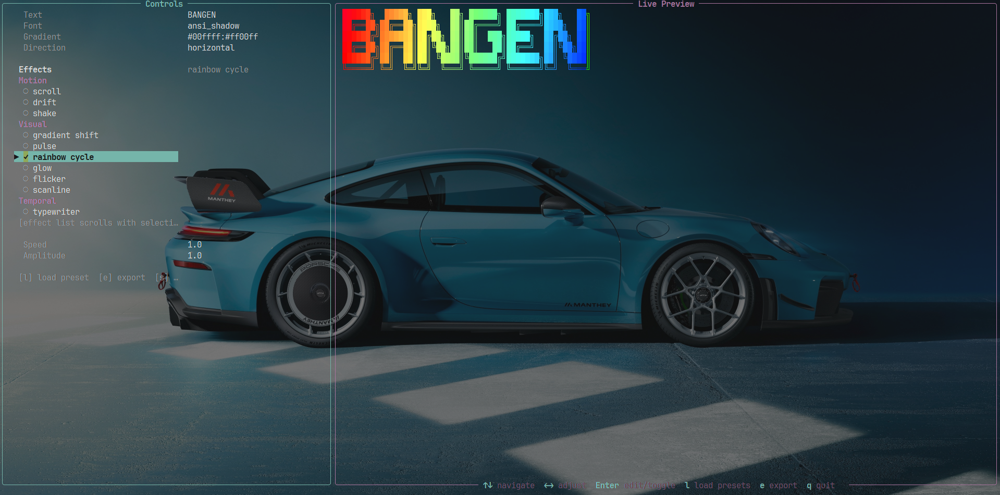

# Bangen

```text
██████╗  █████╗ ███╗   ██╗ ██████╗ ███████╗███╗   ██╗
██╔══██╗██╔══██╗████╗  ██║██╔════╝ ██╔════╝████╗  ██║
██████╔╝███████║██╔██╗ ██║██║  ███╗█████╗  ██╔██╗ ██║
██╔══██╗██╔══██║██║╚██╗██║██║   ██║██╔══╝  ██║╚██╗██║
██████╔╝██║  ██║██║ ╚████║╚██████╔╝███████╗██║ ╚████║
╚═════╝ ╚═╝  ╚═╝╚═╝  ╚═══╝ ╚═════╝ ╚══════╝╚═╝  ╚═══╝
```



**v2.2.0**

Bangen is a modular ASCII rendering engine built on `pyfiglet`, `rich`, and Pillow. It ships with a pipeline-first effect system, live terminal preview, transparent PNG/GIF export, and a tiered library of motion, visual, temporal, distortion, and signature effects.

## Features

- Live split-screen TUI with modal export workflow
- Transparent `PNG` and animated transparent `GIF` export
- Plain `TXT` export with exact static ASCII
- 30-effect library designed for composition order
- Multi-stop gradients with horizontal and vertical interpolation
- Built-in presets plus user presets stored in `~/.bangen/presets/`
- CLI render/export flow plus `--list-effects`, `--list-fonts`, and `--list-presets`

## Installation

```bash
git clone https://github.com/pro-grammer-SD/bangen.git
cd bangen
python -m venv .venv
source .venv/bin/activate
pip install -e .
```

Requirements:

- Python `3.11+`
- `Pillow` is included in the base install

## TUI

Launch the editor:

```bash
bangen
```

Controls:

- `↑↓` navigate fields and effects
- `←→` adjust font or numeric settings
- `Enter` edit/toggle the selected field
- `l` load a saved preset or load from a custom preset file
- `e` open the export dialog
- `s` save the current preset
- `q` quit

The effect selector is windowed, so you can move through the whole library without overflowing the controls panel.

### Export Dialog

Press `e` inside the TUI to open the modal exporter.

- Toggle `GIF`, `PNG`, and `TXT`
- Edit the output path directly
- GIF-only `duration` and `fps` controls
- Auto-updating file extension when the format changes
- Overwrite confirmation for existing files
- Transparent raster output for both `PNG` and `GIF`
- GIF frame cap at `300`

## CLI

Basic rendering:

```bash
bangen "HELLO"
bangen "HELLO" --font slant --gradient "#ff00ff:#00ffff"
bangen "HELLO" --gradient "#ff0000:#ffff00:#00ff00" --gradient-dir vertical
bangen "HELLO" --effect wave --effect chromatic_aberration --effect pulse --speed 1.5 --amplitude 2.0
```

Discovery:

```bash
bangen --list-effects
bangen --list-fonts
bangen --list-presets
```

Preset and AI flows:

```bash
bangen --preset cyberpunk "HELLO"
bangen --preset matrix "SYSTEM"
bangen --preset-file ./my_preset.json "HELLO"
bangen "HELLO" --ai "retro CRT hacker title"
```

Export:

```bash
bangen "HELLO" --export-txt banner.txt
bangen "HELLO" --export-png banner.png
bangen "HELLO" --effect wave --effect glow --effect pulse --export-gif banner.gif --gif-duration 3 --gif-fps 20
```

Terminal animation (useful for temporal effects like `wipe`/`typewriter`):

```bash
bangen "HELLO" --effect wipe --animate --animate-duration 5
```

Legacy HTML export remains available:

```bash
bangen "HELLO" --export-html banner.html
```

## Effect Library

### Motion

- `wave`
- `vertical_wave`
- `bounce`
- `scroll`
- `drift`
- `shake`

### Visual

- `gradient_shift`
- `pulse`
- `rainbow_cycle`
- `glow`
- `flicker`
- `scanline`

### Temporal

- `typewriter`
- `fade_in`
- `wipe`
- `stagger`
- `loop_pulse`

### Distortion

- `glitch`
- `chromatic_aberration`
- `noise_injection`
- `melt`
- `warp`
- `fragment`

### Signature

- `matrix_rain`
- `fire`
- `electric`
- `vhs_glitch`
- `neon_sign`
- `wave_interference`
- `particle_disintegration`

## Composition

Effects are order-sensitive and chainable:

```python
banner.apply(build_effect("wave", config=cfg))
banner.apply(build_effect("chromatic_aberration", config=cfg))
banner.apply(build_effect("pulse", config=cfg))
```

Recommended style stacks:

- `cyberpunk`: `glitch` + `chromatic_aberration` + `pulse`
- `neon`: `glow` + `pulse` or `neon_sign`
- `matrix`: `matrix_rain` + `typewriter`
- `retro`: `scanline` + `flicker`
- `fire`: `fire` + `melt`
- `electric`: `electric` + `glow`

## Gradient Format

Use colon-separated hex stops:

```text
#ff00ff:#00ffff
#ff0000:#ffff00:#00ff00
```

Use `--gradient-dir vertical` for top-to-bottom interpolation.

## Presets

### Where Presets Live

Saved presets are JSON files under:

```text
~/.bangen/presets/*.json
```

You can create these files yourself, save them from the TUI (`s`), or save from the CLI (`--save-preset NAME`).

### Loading Presets

- TUI: press `l` and pick `Source: SAVED` (or switch to `Source: FILE` to load a custom JSON path).
- CLI: `--preset NAME` loads from built-ins or `~/.bangen/presets/`.
- CLI: `--preset-file PATH` loads a preset JSON from any path (it is not automatically saved).

### Creating Presets (JSON Format)

Preset JSON schema (minimal keys shown):

```json
{
  "name": "my_preset",
  "font": "ansi_shadow",
  "gradient": "#ff00ff:#00ffff",
  "gradient_direction": "horizontal",
  "effects": ["wave", "glow", "pulse"],
  "effect_config": {
    "wave": { "speed": 1.8, "amplitude": 2.0, "frequency": 0.7 },
    "pulse": { "speed": 1.2, "min_brightness": 0.55 },
    "glow": {}
  }
}
```

Notes:

- `name`, `font`, and `gradient` are required for a fully-specified preset.
- `gradient` is the same colon-separated stop format as `--gradient`.
- `effects` order matters (the pipeline is compositional and order-sensitive).
- `effect_config` is per-effect; `speed`, `amplitude`, and `frequency` map to the shared `EffectConfig`, and any other keys are effect-specific kwargs.

## Architecture

```text
bangen/
├── effects/
│   ├── base.py
│   ├── distortion.py
│   ├── motion.py
│   ├── signature.py
│   ├── temporal.py
│   ├── utils.py
│   └── visual.py
├── export/
│   ├── exporter.py
│   ├── gif.py
│   ├── png.py
│   └── txt.py
├── gradients/
├── rendering/
└── tui/
    ├── app.py
    └── export_dialog.py
```

## License

MIT. See [LICENSE](LICENSE).
